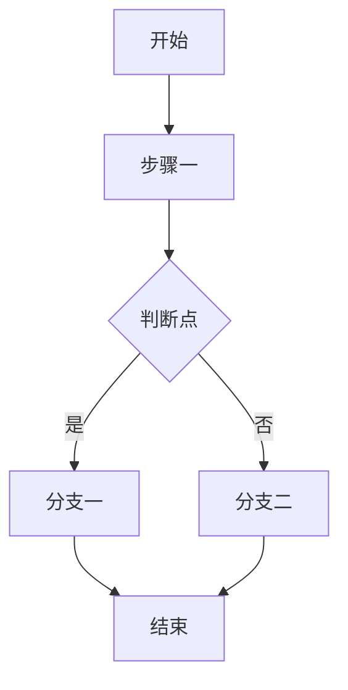
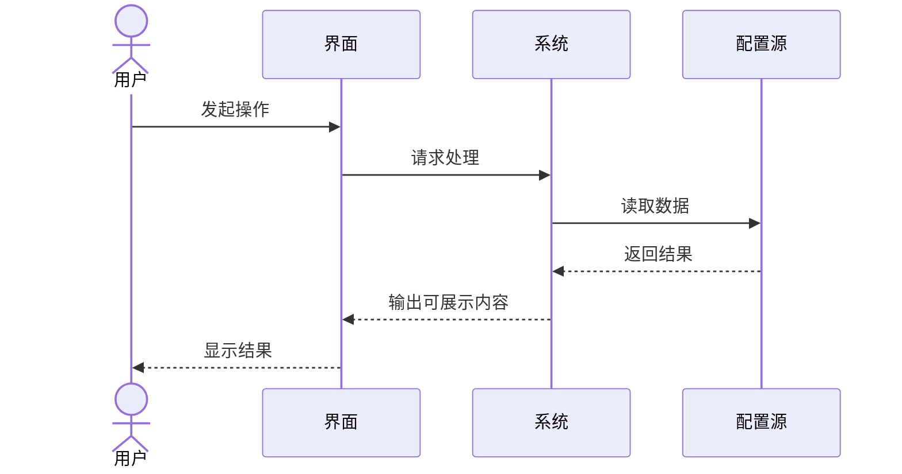
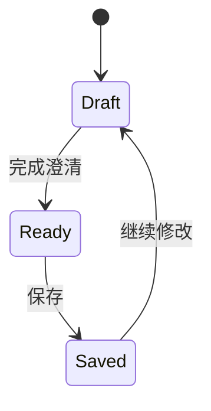

# 业务可视化模板

> 用途：把已经澄清过的业务逻辑，进一步整理成可直观检查的文本化展示结果。

## 1. 业务摘要

- 需求名称：
- 目标：
- 适用角色：
- 本次不关注：

## 2. 主流程图

## 3. 角色时序图

## 4. 状态图

## 5. 界面清单

| 页面 | 目标 | 进入方式 | 关键动作 | 关键输出 |
| --- | --- | --- | --- | --- |
| 页面一 |  |  |  |  |
| 页面二 |  |  |  |  |

## 6. 页面文字卡片

### 页面名

- 页面目标：
- 适用角色：
- 进入条件：

页面区块：

1. 区块一
   - 显示内容：
   - 用户动作：
2. 区块二
   - 显示内容：
   - 用户动作：

页面动作：

- 动作一：
- 动作二：

页面规则：

- 规则一：
- 规则二：

异常提示：

- 异常一：
- 异常二：

## 7. MCP 资源目录

| 类型 | 名称 | 说明 | 输入 | 输出 |
| --- | --- | --- | --- | --- |
| Resource | business://summary | 业务摘要 | 无 | 业务摘要文本 |
| Resource | business://flows/main | 主流程图 | 无 | Mermaid 文本 |
| Prompt | clarify-main-flow | 补齐主流程 | 需求摘要 | 澄清后的流程 |
| Tool | validate-business-bundle | 校验产物完整性 | 业务产物包 | 缺失项列表 |

## 8. 待确认问题

- 问题一：
- 问题二：

## 9. 是否允许进入第二层

- [ ] 可以
- [ ] 还不可以
